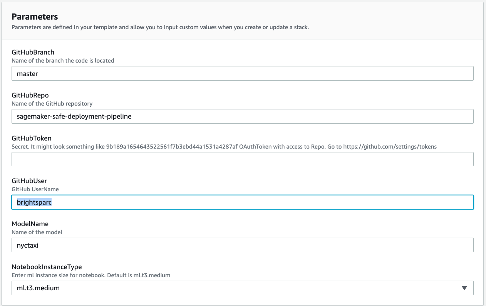

# Amazon SageMaker Safe Deployment Pipeline

## Introduction

This is a sample solution to build a safe deployment pipeline for Amazon SageMaker.  This example could be useful for any organization looking to operationalize machine learning with native AWS development tools such as AWS CodePipeline, AWS CodeBuild and AWS CodeDeploy.

This solution provides as *safe* deployment by creating an AWS Lambda API that calls into an Amazon SageMaker Endpoint for real-time inference.

###  Architecture Diagram

Following is a digram of the continous delivery stages in the AWS Code Pipeline.  

1. Build Artifacts: Runs a AWS CodeBuild job to create AWS CloudFormation templates.
2. Train: Trains an Amazon SageMaker pipline and Baseline Processing Job
3. Deploy Dev: Deploys a development Amazon SageMaker Endpoint
4. Deploy Prod: Deploys an AWS API Gateway Lambda in front of Amazon SageMaker Endpoints using AWS CodeDeploy for blue/green deployment and rollback.

###  Components Details
  - [**AWS SageMaker**](https://aws.amazon.com/sagemaker/) – This solution uses SageMaker to train the model to be used and host the model at an endpoint, where it can be accessed via HTTP/HTTPS requests
  - [**AWS CodePipeline**](https://aws.amazon.com/codepipeline/) – CodePipeline has various stages defined in CloudFormation which step through which actions must be taken in which order to go from source code to creation of the production endpoint.
  - [**AWS CodeBuild**](https://aws.amazon.com/codebuild/) – This solution uses CodeBuild to build the source code from GitHub
  - [**AWS CloudFormation**](https://aws.amazon.com/cloudformation/) – This solution uses the CloudFormation Template language, in either YAML or JSON, to create each resource including custom resource.
  - [**AWS S3**](https://aws.amazon.com/s3/) – Artifacts created throughout the pipeline as well as the data for the model is stored in an Simple Storage Service (S3) Bucket.

## Deployment Steps

Following is the list of steps required to get up and running with this sample.

###  Step 1. Prepare an AWS Account
Create your AWS account at [http://aws.amazon.com](http://aws.amazon.com) by following the instructions on the site.

###  Step 2. Fork this Github Repository
Fork this [GitHub Repository](https://github.com/brightsparc/sagemaker-safe-deployment-pipeline/fork) so that you can run with your own GitHub **Auth Token**.

###  Step 3. Create a GitHub OAuth Token
Create your token at [GitHub's Token Settings](https://github.com/settings/tokens), making sure to select scopes of **repo** and **admin:repo_hook**.  After clicking **Generate Token**, make sure to save your OAuth Token in a secure location. The token will not be shown again.

###  Step 4. Launch the Stack
Click on the **Launch Stack** button below to launch the CloudFormation Stack to set up the SageMaker Pipeline. Before Launching, ensure all architecture, configuration, etc. is set as desired.

You can launch the same stack using the AWS CLI. Here's an example:

`
 aws cloudformation create-stack --stack-name sagemaker-safe-deployment \
   --template-body file://pipeline.yml \
   --capabilities CAPABILITY_IAM \
   --parameters \
       ParameterKey=GitHubUser,ParameterValue=youremailaddress@example.com \
       ParameterKey=GitHubToken,ParameterValue=YOURGITHUBTOKEN12345ab1234234 \
       ParameterKey=ModelName,ParameterValue=mymodelname
`

Folling is a list of the paramters for running the cloud formation.

<!-- ### pipeline.yaml -->
Parameters | Description
---------- | -----------
Email | The email where CodePipeline will send SNS notifications.
GitHubUser | GitHub Username.
GitHubToken | A Secret OAuthToken with access to the GitHub repo.
GitHubRepo | The name (not URL) of the GitHub repository to pull from.
GitHubBranch | The name (not URL) of the GitHub repository’s branch to use.
ModelName | The short name to namespace all the mlops resources.

Make sure you also update the `GitHubUser` stack parameter to be from your forked account.

###  Step 5. Start, Test and Approve the Deployment

Once the deployment has completed, there will be a new AWS CodePipeline created linked to your GitHub source.  You will notice initially that it will be in a *Failed* state as it is waiting on an S3 data source.

Launch the newly created SageMaker Notebook in your [AWS console](https://aws.amazon.com/getting-started/hands-on/build-train-deploy-machine-learning-model-sagemaker/), navigate to the `notebook` directory and opening the notebook by clicking on the `mlops.ipynb` link.

Once the notebook is running, you will be guided through a series of steps starting with downloading the  [New York City Taxi](https://registry.opendata.aws/nyc-tlc-trip-records-pds/) dataset, uploading this to an Amazon SageMaker S3 bucket along with the data source meta data to trigger a new build in the AWS CodePipeline.

Once your pipeline is kicked off it will run model training and deploy a development SageMaker Endpoint.  

There is a manual approval step which you can action directly within the SageMaker Notebook to promote this to production, send some traffic to the live endpoint and create a REST API.

Subsequent deployments of the pipeline will use AWS CodeDeploy to perform a blue/green deployment to shift traffic from the Original to Replacement endpoint over a period of 5 minutes.

Finally, the SageMaker Notebook provides the ability to retrieve the results from the Monitoring Schedule that is run on the hour.

###  Approximate Times:

Following is a lis of approximate running times fo the pipeline

* Full Pipeline: 45 minutes
* Start Build: 2 Minutes
* Model Training and Baseline: 5 Minutes
* Launch Dev Endpoint: 10 minutes
* Launch Prod Endpoint: 25 minutes
* Monitoring Schedule: Runs on the hour
