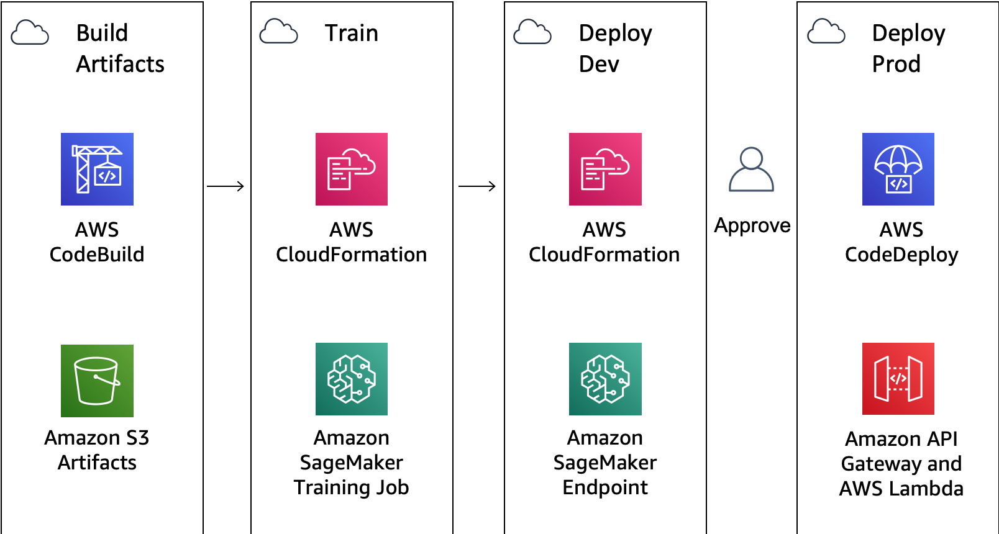

# Amazon SageMaker Safe Deployment Pipeline

## Introduction

This is a sample solution to build a safe deployment pipeline for Amazon SageMaker.  This example could be useful for any organization looking to operationalize machine learning with native AWS development tools such as AWS CodePipeline, AWS CodeBuild and AWS CodeDeploy.

This solution provides as *safe* deployment by creating an AWS Lambda API that calls into an Amazon SageMaker Endpoint for real-time inference.

## Prerequisites

- **AWS account** – Follow these instructions to create an AWS Account: [Create an AWS Account](http://docs.aws.amazon.com/AmazonSimpleDB/latest/DeveloperGuide/AboutAWSAccounts.html)
- **GitHub OAuth Token** – Follow these instructions to create an OAuth Token: [Create a GitHub OAuth Token](https://docs.aws.amazon.com/codepipeline/latest/userguide/GitHub-authentication.html)
- **Forked GitHub Repository** - Fork this repository to your GitHub account: <a href="https://github.com/brightsparc/sagemaker-safe-deployment-pipeline/fork">Fork</a>

###  Architecture Diagram

###  Components Details
  - [**AWS SageMaker**](https://aws.amazon.com/sagemaker/) – This solution uses SageMaker to train the model to be used and host the model at an endpoint, where it can be accessed via HTTP/HTTPS requests
  - [**AWS CodePipeline**](https://aws.amazon.com/codepipeline/) – CodePipeline has various stages defined in CloudFormation which step through which actions must be taken in which order to go from source code to creation of the production endpoint.
  - [**AWS CodeBuild**](https://aws.amazon.com/codebuild/) – This solution uses CodeBuild to build the source code from GitHub
  - [**AWS CloudFormation**](https://aws.amazon.com/cloudformation/) – This solution uses the CloudFormation Template language, in either YAML or JSON, to create each resource including custom resource.
  - [**AWS S3**](https://aws.amazon.com/s3/) – Artifacts created throughout the pipeline as well as the data for the model is stored in an Simple Storage Service (S3) Bucket.

